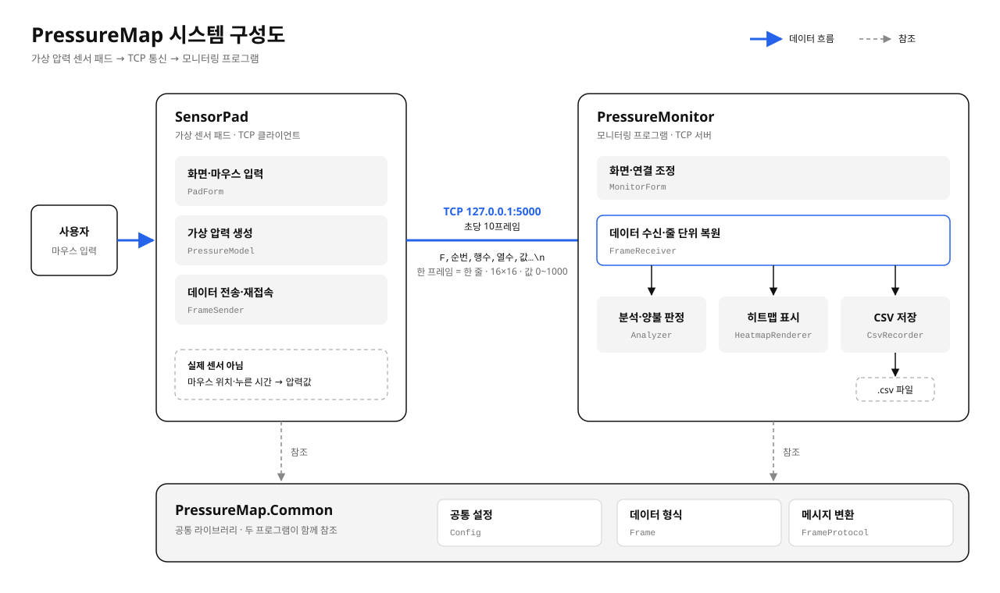

# PressureMap

C# WinForms(.NET Framework 4.8)로 만드는 가상 압력 센서 패드와 모니터링 프로그램입니다. (진행 중)

> 실제 압력 센서는 사용하지 않습니다. 마우스로 누른 위치와 시간을 압력값으로 바꾸는 "가상 압력 센서"입니다.

## 시스템 구성도

## 구성
- **SensorPad**: 마우스 입력을 16x16 압력값으로 바꿔 TCP로 초당 10회 전송
- **PressureMonitor**: 수신한 데이터를 히트맵으로 표시하고 최대·평균·균일도 계산, 양불 판정, CSV 기록
- **PressureMap.Common**: 두 프로그램이 공유하는 데이터 형식과 설정
